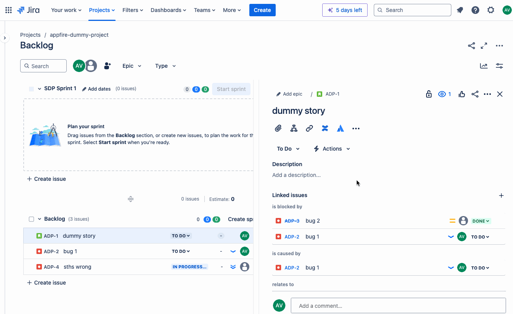

# React - Forge UIKit app



This project contains a Forge app written in React(with TypeScript) that displays all linked bugs
to a Jira issue in the issue panel. The bug links are put in a datagrid. Each link can be deleted.
The priority and status columns are sorted based on the jira order configuration.

See [developer.atlassian.com/platform/forge/](https://developer.atlassian.com/platform/forge) for documentation and tutorials explaining Forge.

## Requirements

See [Set up Forge](https://developer.atlassian.com/platform/forge/set-up-forge/) for instructions to get set up.

## Quick start

- Modify your app frontend by editing the `src/frontend/index.tsx` file.

- Modify your app backend by editing the `src/resolvers/index.ts` file to define resolver functions. See [Forge resolvers](https://developer.atlassian.com/platform/forge/runtime-reference/custom-ui-resolver/) for documentation on resolver functions.

- Install dependencies:
```
npm install
```

- Build and deploy your app by running:
```
forge deploy
```

- Install your app in an Atlassian site by running:
```
forge install
```

- Develop your app by running `forge tunnel` to proxy invocations locally:
```
forge tunnel
```

### Notes
- Use the `forge deploy` command when you want to persist code changes.
- Use the `forge install` command when you want to install the app on a new site.
- Once the app is installed on a site, the site picks up the new app changes you deploy without needing to rerun the install command.

## Support

See [Get help](https://developer.atlassian.com/platform/forge/get-help/) for how to get help and provide feedback.
